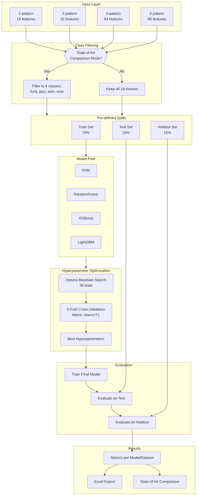
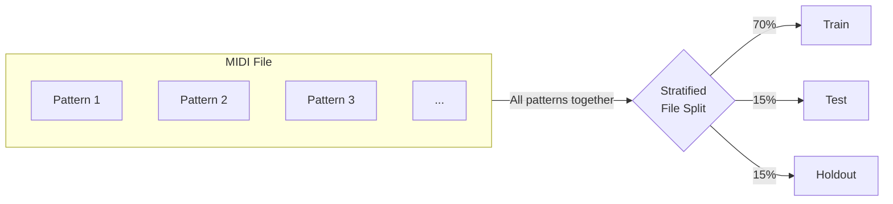
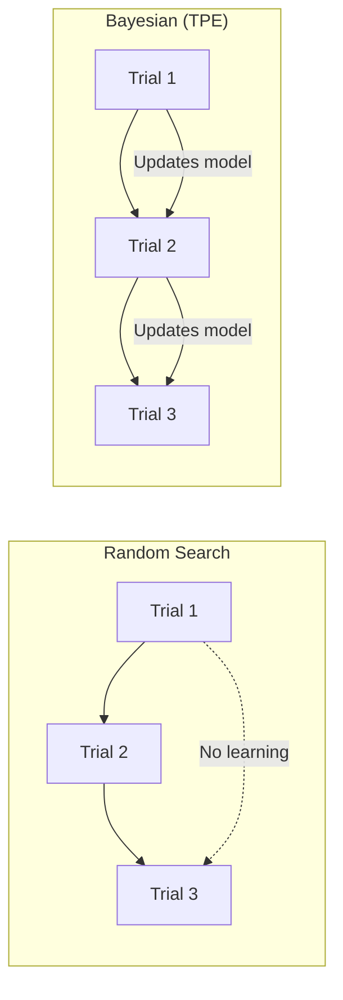
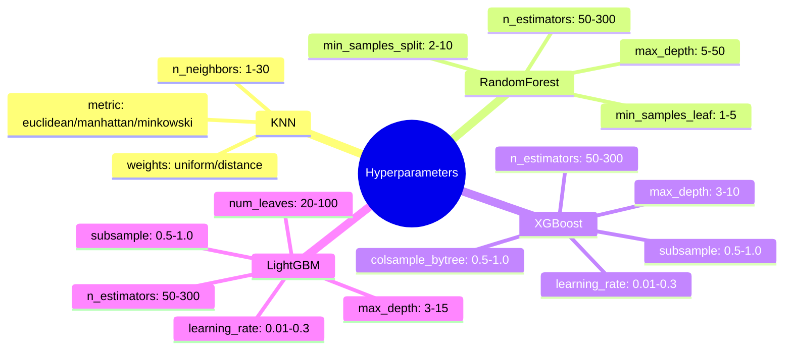
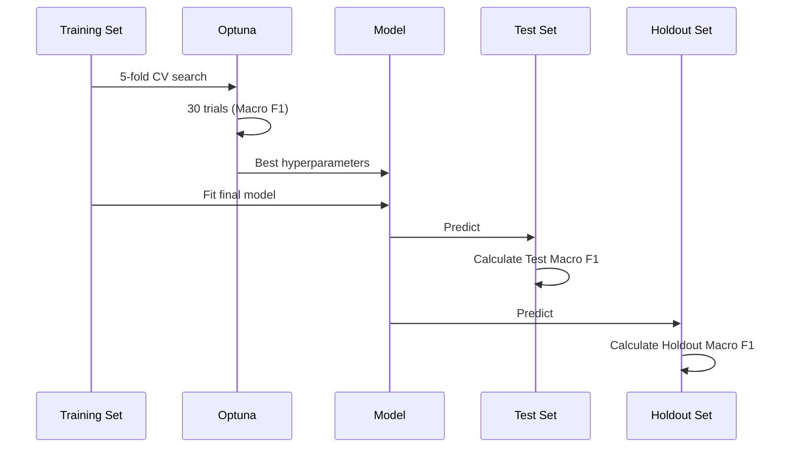
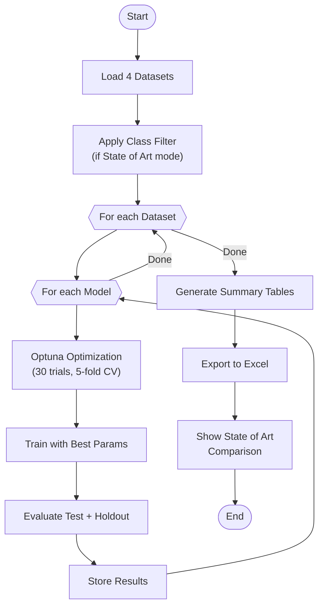

# Classification Pipeline

## Overview

This document describes the machine learning pipeline for drum pattern genre classification using the FWOD (Flattened Weighted Onset Distribution) representation.

---

## 1. Pipeline Flow

---

## 2. Datasets

The pipeline evaluates four dataset configurations, each representing different temporal aggregations:

| Dataset | Features | Description | Temporal Context |
|---------|----------|-------------|------------------|
| 1-pattern | 16 | Single bar | 1 measure |
| 2-pattern | 32 | Two consecutive bars | 2 measures |
| 4-pattern | 64 | Four consecutive bars | 4 measures |
| 5-pattern | 80 | Five consecutive bars | 5 measures |

**Rationale**: Longer aggregations capture cyclic patterns common in genres (e.g., 2-bar or 4-bar phrases).

---

## 3. Class Filtering

### State of Art Mode (4 classes)
For comparison with the reference paper, the pipeline filters to:
- **funk**
- **jazz**
- **latin**
- **rock**

This matches the experimental setup of "Improved Symbolic Drum Style Classification with Grammar-Based Hierarchical Representations".

### Full Mode (18 classes)
All available genres in the dataset:
`afrobeat, afrocuban, blues, country, dance, funk, gospel, highlife, hiphop, jazz, latin, middleeastern, neworleans, pop, punk, reggae, rock, soul`

---

## 4. Data Splitting Strategy

The split is performed at the **file level** to prevent data leakage:

**Key Guarantee**: All patterns from the same source file belong to the same split, eliminating correlation leakage.

---

## 5. Models

| Model | Type | Key Characteristics |
|-------|------|---------------------|
| **KNN** | Instance-based | Distance metric learning, no assumptions about data distribution |
| **RandomForest** | Ensemble (Bagging) | Robust to overfitting, handles feature interactions |
| **XGBoost** | Ensemble (Boosting) | Gradient boosting, regularization, handles imbalanced data |
| **LightGBM** | Ensemble (Boosting) | Faster training, leaf-wise growth, memory efficient |

---

## 6. Hyperparameter Optimization

### Optuna Configuration
- **Trials**: 30 per model
- **Sampler**: TPESampler (Tree-structured Parzen Estimator)
- **Optimization**: Bayesian (sequential model-based)
- **Objective**: Maximize Macro F1 Score
- **Validation**: 5-fold cross-validation on training set

### Why Bayesian Optimization (TPE)?

| Aspect | Random Search | Bayesian (TPE) |
|--------|--------------|----------------|
| Strategy | Independent samples | Informed by history |
| Efficiency | Low | High |
| Convergence | Slow | Fast |
| Exploration/Exploitation | Only exploration | Balanced |

**TPE** construye dos distribuciones:
- $l(x)$: Hiperparámetros que dieron buenos resultados
- $g(x)$: Hiperparámetros que dieron malos resultados

Maximiza: $\frac{l(x)}{g(x)}$ para elegir el siguiente trial

### Search Spaces

---

## 7. Metrics

### Primary Metric: Macro F1 Score

$$\text{Macro F1} = \frac{1}{N} \sum_{i=1}^{N} F1_i$$

Where $F1_i$ is the F1 score for class $i$:

$$F1_i = 2 \cdot \frac{\text{Precision}_i \cdot \text{Recall}_i}{\text{Precision}_i + \text{Recall}_i}$$

**Why Macro F1?**
- Treats all classes equally regardless of sample size
- Penalizes poor performance on minority classes
- Same metric used in state of art paper (enables direct comparison)

### Secondary Metric: Accuracy

$$\text{Accuracy} = \frac{\text{Correct Predictions}}{\text{Total Predictions}}$$

Reported for reference but not used for model selection.

---

## 8. Evaluation Protocol

### Three-Level Evaluation

| Level | Data | Purpose |
|-------|------|---------|
| **CV Score** | Training (5-fold) | Hyperparameter selection |
| **Test Score** | Test set | Model comparison |
| **Holdout Score** | Holdout set | Final unbiased estimate |

---

## 9. State of Art Comparison

### Reference Paper
- **Title**: "Improved Symbolic Drum Style Classification with Grammar-Based Hierarchical Representations"
- **Best Result**: Macro F1 = 0.66
- **Method**: Transformer + TBPE (Tree-Based Positional Encoding)
- **Classes**: funk, jazz, latin, rock

### Comparison Criteria
| Aspect | Our Pipeline | State of Art |
|--------|-------------|--------------|
| Classes | 4 (filtered) | 4 |
| Metric | Macro F1 | Macro F1 |
| Split | 70/15/15 (file-level) | 80/10/10 |
| Features | FWOD (16-80) | Grammar tokens |

---

## 10. Output

### Console Output
- Rich formatted tables per model
- Best configuration per model
- Overall best configuration
- State of art comparison panel

### Excel Export
Three sheets:
1. **All Results**: Complete results matrix (Dataset × Model)
2. **Best Per Model**: Best dataset configuration for each model
3. **Overall Best**: Single best configuration with state of art comparison

---

## 11. Execution Flow Summary

---

## 12. Reproducibility

| Parameter | Value |
|-----------|-------|
| Random State | 42 |
| CV Folds | 5 |
| Optuna Trials | 30 |
| Split Ratios | 70/15/15 |

All experiments use the same random seed for reproducible results.
