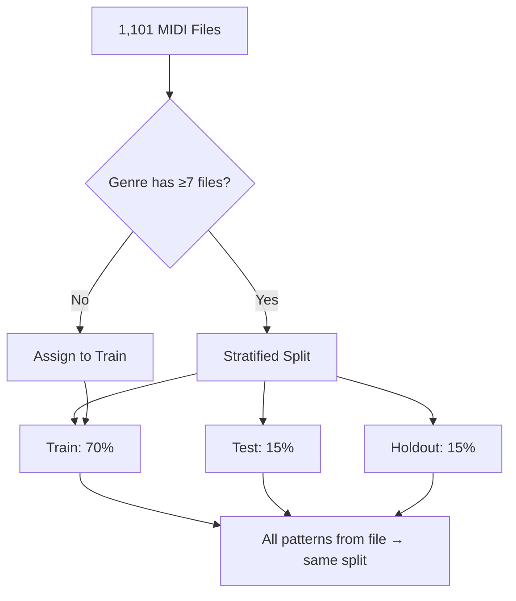

# Train-Test-Holdout Split Strategy

## Problem: Data Leakage

Standard random splitting at the **pattern level** causes data leakage: consecutive patterns from the same MIDI file are highly correlated and may end up in both train and test sets.

## Solution: File-Level Stratified Split



**Key guarantee:** All patterns extracted from the same MIDI file belong to the same split.

## Split Distribution by Genre

### Files per Split

| Genre | Train | Test | Holdout | Total |
|-------|------:|-----:|--------:|------:|
| rock | 219 | 46 | 48 | 313 |
| funk | 106 | 22 | 23 | 151 |
| jazz | 71 | 15 | 15 | 101 |
| latin | 68 | 14 | 15 | 97 |
| hiphop | 64 | 14 | 14 | 92 |
| afrocuban | 40 | 9 | 9 | 58 |
| punk | 40 | 9 | 9 | 58 |
| neworleans | 37 | 8 | 8 | 53 |
| soul | 36 | 7 | 8 | 51 |
| country | 20 | 5 | 4 | 29 |
| pop | 17 | 4 | 3 | 24 |
| reggae | 14 | 3 | 3 | 20 |
| gospel | 11 | 3 | 3 | 17 |
| afrobeat | 9 | 2 | 2 | 13 |
| dance | 5 | 1 | 1 | 7 |
| blues* | 4 | 0 | 0 | 4 |
| highlife* | 2 | 0 | 0 | 2 |
| middleeastern* | 1 | 0 | 0 | 1 |

*Genres with <7 files assigned to train only (insufficient for stratified 3-way split).

### Patterns per Split

| Dataset | Train | Test | Holdout | Total |
|---------|------:|-----:|--------:|------:|
| Base (16 features) | 14,740 | 3,532 | 2,787 | 21,059 |
| 2-pattern (32 features) | 13,976 | 3,370 | 2,622 | 19,968 |
| 4-pattern (64 features) | 13,317 | 3,229 | 2,480 | 19,026 |
| 5-pattern (80 features) | 13,033 | 3,166 | 2,422 | 18,621 |

## Implementation

Split assignment stored in `split` column: `train`, `test`, or `holdout`.

```python
# Usage in classifier
train_data = df[df['split'] == 'train']
test_data = df[df['split'] == 'test']
holdout_data = df[df['split'] == 'holdout']
```

Parameters: `random_state=42` for reproducibility.
